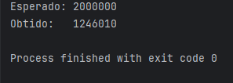

Parte 3 — Deadlock

1. Introdução

Deadlock é uma condição em que dois ou mais processos não conseguem prosseguir porque cada um está esperando que o outro libere um recurso. Para que o deadlock aconteça, quatro condições de Coffman devem ocorrer simultaneamente:

- Exclusão mútua

- Manter-e-esperar (hold and wait)

- Não preempção

- Espera circular

2. Reproduzindo o deadlock

O código fornecido implementa duas threads e dois locks:

- Thread 1: adquire LOCK_A → LOCK_B

- Thread 2: adquire LOCK_B → LOCK_A

Os logs obtidos mostram:

T1 pegou LOCK_A

T2 pegou LOCK_B

T1 tentando LOCK_B

T2 tentando LOCK_A
(Aqui ocorre o deadlock)

3. Por que o deadlock ocorre? (Condições de Coffman)
   

Como todas se manifestam ao mesmo tempo, o deadlock é inevitável.

4. Correção adotada: hierarquia global de recursos

Para eliminar o deadlock, imponho uma ordem fixa de aquisição:

LOCK_A → LOCK_B

Todas as threads seguem essa mesma ordem.

Isso remove a condição de espera circular, pois não é mais possível criar um ciclo:

T1: A → B  
T2: A → B

Não há mais “T1 espera T2 que espera T1”, pois todos adquirem os recursos na mesma ordem.

5. Resultado

Com a ordem fixa aplicada:

- Nenhuma execução entra em deadlock
- Os logs sempre mostram progresso
- A espera circular deixa de existir (condição de Coffman removida)

6. Conexão com o Jantar dos Filósofos

A solução aplicada aqui é a mesma estratégia clássica para evitar deadlock nos filósofos:

- Definir uma hierarquia fixa de garfos/recursos
- Remover a possibilidade de ciclos de espera