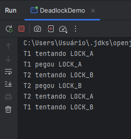

Este arquivo registra a saída da execução do programa que contém deliberately um deadlock. As duas threads (T1 e T2) adquirem os locks em ordens opostas (A→B e B→A), o que provoca uma espera circular. O log mostra que ambas as threads pegam o primeiro lock e ficam bloqueadas ao tentar adquirir o segundo. O programa não conclui e permanece travado sem lançar exceção, caracterizando o deadlock:

