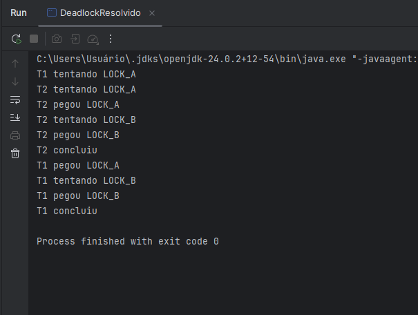

Este arquivo registra a saída do programa após a correção do deadlock. Foi imposta uma ordem global de aquisição de recursos, onde todas as threads sempre adquirem primeiro LOCK_A e depois LOCK_B. Isso elimina a espera circular. O log mostra que ambas as threads conseguem executar completamente e chegam à mensagem de conclusão, comprovando que o deadlock foi resolvido:

